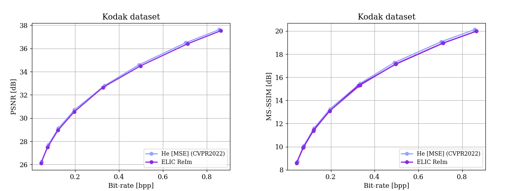

# ELIC: Efficient Learned Image Compression withUnevenly Grouped Space-Channel Contextual Adaptive Coding.
A Pytorch Implementation of "ELIC: Efficient Learned Image Compression withUnevenly Grouped Space-Channel Contextual Adaptive Coding."

Note that This Is Not An Official Implementation Code.

More details can be found in the following paper:
```
@inproceedings{he2022elic,
  title={Elic: Efficient learned image compression with unevenly grouped space-channel contextual adaptive coding},
  author={He, Dailan and Yang, Ziming and Peng, Weikun and Ma, Rui and Qin, Hongwei and Wang, Yan},
  booktitle={Proceedings of the IEEE/CVF Conference on Computer Vision and Pattern Recognition},
  pages={5718--5727},
  year={2022}
}
```

## Related links
 * CompressAI: https://github.com/InterDigitalInc/CompressAI
 * ELIC-QVRF：https://github.com/VincentChandelier/ELIC-QVRF
 * QVRF：https://github.com/bytedance/QRAF
 
 # Available Checkpoint
| lambda |  Link                                                                                              |
| ----|---------------------------------------------------------------------------------------------------|
| 0.45 | [0.45](https://drive.google.com/file/d/1uuKQJiozcBfgGMJ8CfM6lrXOZWv6RUDN/view?usp=sharing)    |
| 0.15 | [0.15](https://drive.google.com/file/d/1s544Uxv0gBY3WvKBcGNb3Fb22zfmd9PL/view?usp=sharing)    |
| 0.032 | [0.032](https://drive.google.com/file/d/1Moody9IR8CuAGwLCZ_ZMTfZXT0ehQhqc/view?usp=sharing)    |
| 0.016 | [0.0016](https://drive.google.com/file/d/1MWlYAmpHbWlGtG7MBBTPEew800grY5yC/view?usp=sharing)     |
| 0.008| [0.008](https://drive.google.com/file/d/1VNE7rx-rBFLnNFkz56Zc-cPr6xrBBJdL/view?usp=sharing) |
| 0.004 | [0.004](https://drive.google.com/file/d/1YGVJ9bpeEq0xfqka2xkaMzhDkeYFJi6q/view?usp=sharing)    |

 
 # dataset
 According to the paper, They train the models on the largest 8000 images picked from ImageNet dataset.
 so download the [ImageNet](http://www.image-net.org/challenges/LSVRC/2012/dd31405981ef5f776aa17412e1f0c112/ILSVRC2012_img_train.tar)
 
 unzip those download images
 ```
 # cd the imagedatasetSavingDir
 for tar in *.tar;  do tar xvf $tar; done
 ```
 Run the code to prepare the Training dataset.
 
 
# Environment
   This code is based on the [CompressAI](https://github.com/InterDigitalInc/CompressAI).

```
   pip3 install torch torchvision torchaudio
   pip3 install compressai=1.1.5
   pip3 install thop, ptflops, timm
```

# Usage

## Train Usage
   ```
   cd Code
   python3 train.py -d ./dataset --N 192 --M 320 -e 4000 -lr 1e-4 -n 8 --lambda 13e-3 --batch-size 16 --test-batch-size 16 --aux-learning-rate 1e-3 --patch-size 256 256 --cuda --save --seed 1926 --clip_max_norm 1.0
   ```
   In ELIC, each model is finetune by 200 epoches.
   ```
   python3 train.py -d ./dataset --N 192 --M 320 -e 4000 -lr 1e-4 -n 8 --lambda 13e-3 --batch-size 16 --test-batch-size 16 --aux-learning-rate 1e-3 --patch-size 256 256 --cuda --save --seed 1926 --clip_max_norm 1.0 --pretrained --checkpoint Pretrained4000epoch_checkpoint.pth.tar
   ```
## Update the entropy model
```
python3 -m updata.py checkpoint -n updatacheckpoint-name
```
## Test 

```
python Inference.py --dataset/test --output_path Result_dir -p checkpoint.pth.tar
```

# RD Results
We trained the network and ask the RD points from the author.

